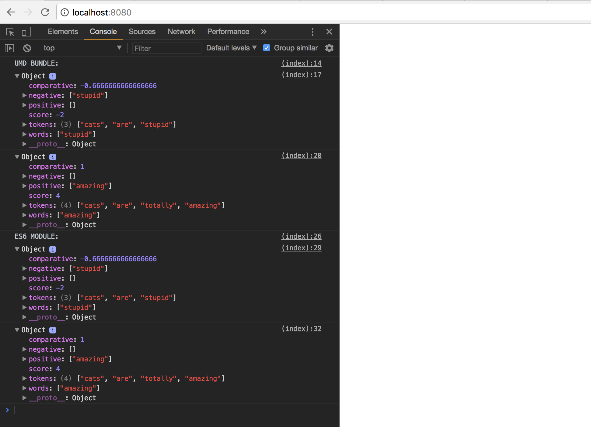

# How to Run:

In your command line:

```
npm run serve
```

This runs the following:

```
"npx http-serve --cors"
```

Then open up [localhost:8080](http://localhost:8080), and check out the console!

The output should look like this:


